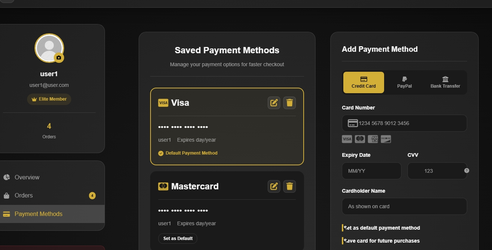
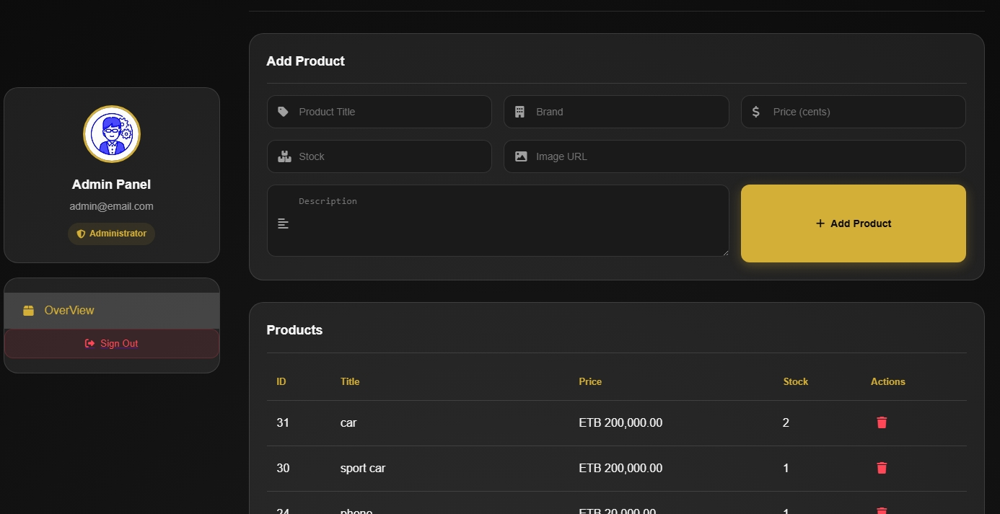

# E-commerce

An Ecommerce web application built with PHP and MySQL. It provides customer management, product, order processing, and admin functionality. This project is designed to be lightweight, easy to set up, and extensible for future features.

# Features
- Customer Management
- Registration & login
- Profile with billing/shipping details
- Product Expore
- Add, delete products
- Stock management
- Orders
- Place orders with 
- Track order status (pending, shipped, completed)
- Admin Panel
- Manage customers, products, and orders
- Default admin account created on first run
- App Settings
- Configurable demo mode for pricing

#  Installation
- Clone the repository
git clone https://github.com/0xN7y/E-commerce.git
cd ecommerce
- Setup Database
- Ensure MySQL is running.
- The db.php file will automatically:
- Create the Ecommerce database if not exists.
- Create all required tables
- Insert default admin and settings.
- Configure Database Connection Edit db.php if needed:
```php
$servername = "localhost"; // edit here
$username   = "root"; // edit here
$password   = ""; // edit here
$dbname     = "Ecommerce";
```
- Run the Project
- Place the project in your web server root (e.g., htdocs for XAMPP).
- Open in browser:


# Default Admin Login
- Email: admin@email.com
- Password: admin


#  Technologies Used
- Backend: PHP (mysqli)
- Database: MySQL
- Frontend: HTML, CSS, JavaScript


# Notes
- On first run, a loading screen will appear while tables are created.
- Use INSERT IGNORE for seed data to avoid duplicates.
- Extendable for payment gateways, shipping APIs, and user roles.

# Images








